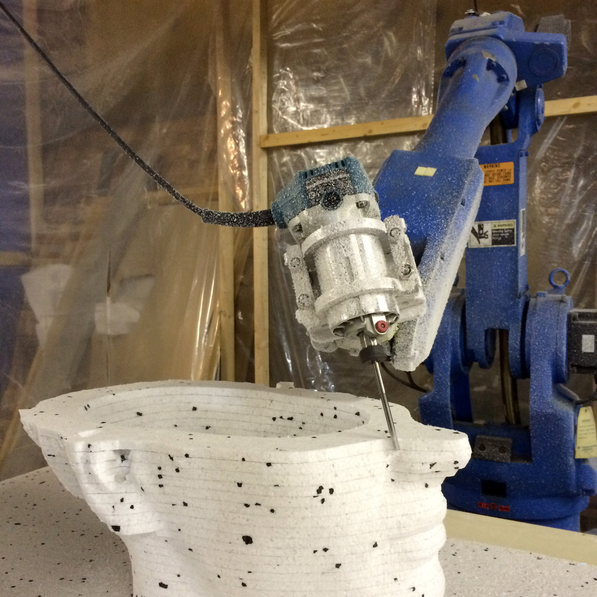
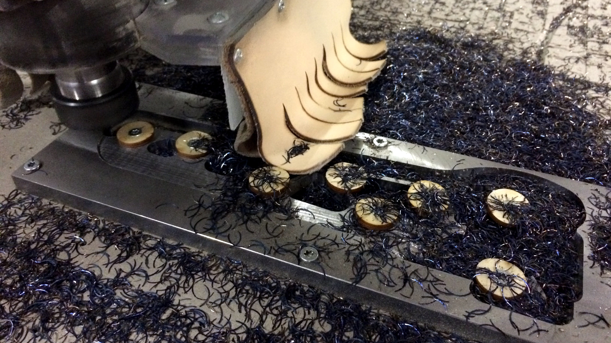
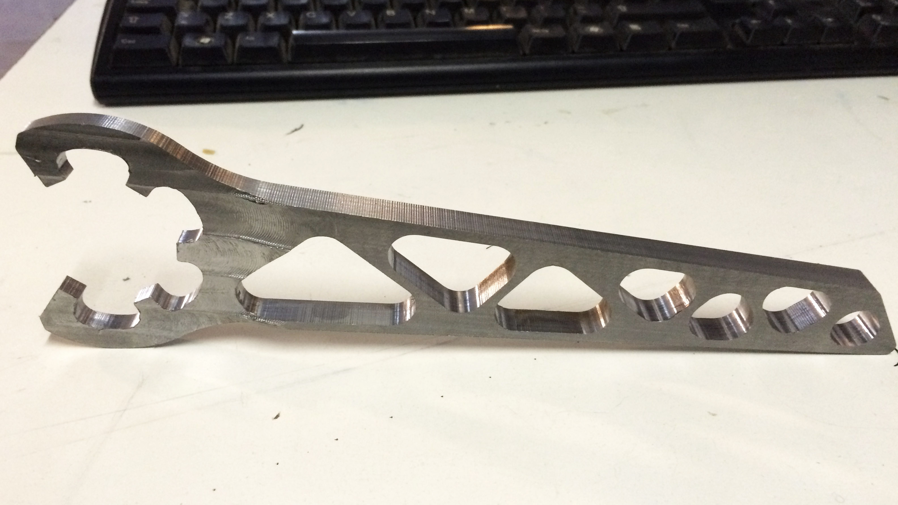
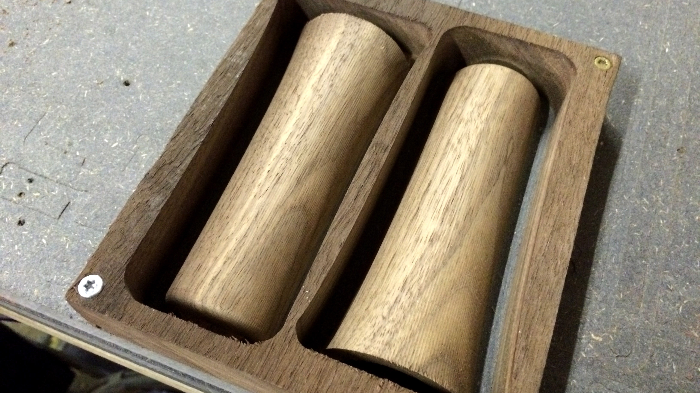
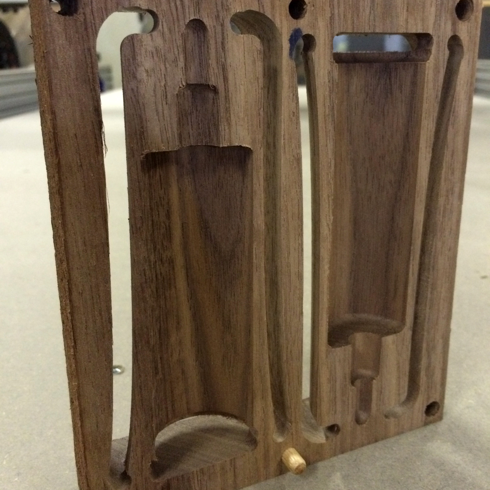

# Bark beetle - parametric toolpath plugin for Grasshopper

*Developed by Jens Dyvik / Fellesverkstedet*

Check the CNC milling example in the Examples - Stable release folder. Make sure you specify your streaming destination as instructed below.

**To use the tool**

* Go to [Stable release](https://github.com/fellesverkstedet/Bark-beetle-parametric-toolpaths/tree/master/Examples%20-%20Stable%20release) and download the latest version + the template file.
* Open the template file in rhino and the grasshopper file in grasshopper. The template file contains layers which indicate what grasshopper needs to do with the geometry on those layers. 

To use the streaming function of the file, you need to first specify your streaming destination. Cloud storage connected to the pc running your cnc-machine can be a huge time safer here. All changes will then be automatically streamed to the folder of your machine. 

* Zoom out in the Example grasshopper file to see the "Post processor settings" and then zoom in on the purple group. [Image for reference](https://raw.githubusercontent.com/fellesverkstedet/Bark-beetle-parametric-toolpaths/master/Images/Set%20directory%20path.png)
* In this group you will find a component saying "Toolpath streaming folder". Right click on this component and click on "Select a directory" [Image for reference](https://raw.githubusercontent.com/fellesverkstedet/Bark-beetle-parametric-toolpaths/master/Images/Set%20directory%20path%202.png)
* You'll get a prompt asking to define a folder for streaming. Choose a folder as a destination for all files to be automatically streamed to.

Now every time you make a job, this file will automatically update, ready for you to run the job.
>> If it's not updating, right click again and check that streaming is enabled.

# General Workflow

* Open Bark Beetle example file and Rhino example file.
* Draw or import your 2D or 3D geometry.
* Place the geometry in the layer that describes the action you want to perform, such as Drill or Pocket etc.
* Specify material type, milling bit and and the depth of milling for each process.
* Check in perspective view to verify number of tool passes.
* Run the job. Bark Beetle streams your job so you don't have to save every change.

# Advanced Workflow 

Either modify the Example file or use the clustered components from the plug-in toolbar to create your own definition.
Hover your pointer over each component to discover what they do. 
If you have pre-existing GH definitions, like a piece of furniture, then you can use the Bark Beetle components directly inside your definition.
>> This means that your definition becomes a CADCAM file - if you change the material thickness of your object, your gcode is automatically ready to run. 

# Contributing

If these instructions could be clearer, please feel welcome to make suggestions by logging an issue, and if you want to suggest changes to the project, make a pull request.

# Features

### CNC milling toolpaths:

**Automill**
* Dissects a Brep and outputs curves, surfaces and cut depths for 2D and 3D milling. Can make it lightning fast to set up a combo 2D and 3D milling jobs. No need to set up different pocket and cut depths or isolate 2D geometry from 3D.

**Cutout (or Profile)**
* Creates cutout toolpaths from closed flat 2D curves. Compensates for the diameter of your milling bit.
* It will detect curves inside curves. Inside curves will be cut first and on the inside of the curve. Outside curves last and on the outside of the curve.
* Note: Only one level of curve inside curve is supported. Use multiple setups to achieve a cure inside a curve inside a curve.
* Supports climb and conventional cutting direction
* Supports inside cutting, but remember to switch of when your are done cutting a inside hole. Cutting your outer geometry on the inside is classic.

**Dogbone maker**
* Automatically adds dogbones to toolpath curves. Dogbones are used for making sharp internal cornes. This overcomes to challenge of making a sharp corner with a round spinning milling bit

**Drill**
* Creates a drilling toolpath from the center of the input geometry, usually circles. Handy for making pre milling hold down holes.
* Pro-tip: Make your input circle diameter the diameter of your screw head + 2x  the diameter of your milling  bit. Then you see how close your screw holes can be to your cutting geometry. If your screw hole circle and cutting geometry overlap, you are in trouble.

**Engrave**
* Makes the center of your bit follow 2D and 3D curves. Handy for making your own freestyle toolpaths.
* Can create pass depths.
* Be careful about the start depths of your curves. Pass depth and cut depth assumes your input curve starts at surface level (Z0).

**Horizontal 3D mill from mesh - experimental**
* Makes horizontal roughing, finishing and cutouts from mesh. Attempts to distribute slicing levels optimally based on surface angle analysis. Not 100% reliable, always check your toolpaths in 3D view before running.

**Make pass depths**
* Creates pass depths from 2D and 3D toolpath curves. Handy for creating 3D roughing operations from Surface 3D mill or freestyle 3D curves.
* Enables the milling machine to dig its way down to the surface of a 3D object, layer by layer (pass depth). This makes enables a 3D finish operations to have very little material left to clear, making high speeds and smooth result possible.

**Pocket**
* Creates pockets from closed curves. Used to clear all the material inside a curve to a specific depth.
* Supports curves inside a curve to make islands in a pocket. But only at one level. An island inside an island inside an island is not supported. Use multiple cutting operations to achieve this.

**Surface 3D mill**
* Extracts iso-curves from a surface to create evenly spaced toolpaths. A great companion with the automill function.
* Note: Collision detection makes long calculation time for big objects.

**Trochoidal High Speed Milling**
* Makes highspeed toolpaths for deep and fast cutting in metal. Input toolpath curves for the arcs to follow. Be careful about feedrates and stepovers. Prioritize deep passes and small stepovers (0.05 to 0.2).
* This technique is known as high speed machining.

### Toolpath tools:

**Auto tabbing**
* Automatically creates tab location points along cutting geoemtry. Combine these points with the "Tab maker' function for fully automatic tab creation. NOTE: Limited functionality as of now. Mainly works with rectangular shapes and places tabs close to the corners along Y (to prevent tear out when removing parts from the machine)

**Safe offset curve**
* Always makes closed non intersecting curves from offset. Can handle extreme offset values.

**Tab maker**
* Automatically creates tab boxes along your cutting geometry. Uses points as input.

### Information tools:

**Compile settings**
* Compiles an overview of current milling settings. Nice for quickly checking your settings, or the output from the feedrate calculator, before running a job.

**Feed rate library - experimemtal**
* Outputs CNC milling settings based on material type, bit diameter, bit type. Current values based on ShopBot alpha, single flute end mills and 18000 rpm spindle speed

**Feedrate Calculator**
*Calculates a feedrate matching chipload and rpm.

* Can take chip thining into account. Input the maxium stepover the tool will encounter. Normal pockets and profiles will have a full stepover of 0.5 (50%) and higher, while the Arc Based High speed milling have constant low stepovers as specified.

**Feedrate Calculator for Arcs**
* Compensates for the speed difference between the center of a bit and its outer edge when cutting in circular paths.
* Calculates a feedrate matching chipload and rpm.
* This speed difference is similar to how the wheels on a car spin at different speeds during a turn.
* Can take chip thining into account. Input the maxium stepover the tool will encounter. Normal pockets and profiles will have a full stepover of 0.5 (50%) and higher, while the Arc Based High speed milling have constant low stepovers as specified.

**Find deepest Z**
* Finds the deepest Z coordinate in your toolapths. Handy for safety checks!

**Machining time**
* Calculates the time it will take to complete a set of toolpaths

### Post processors:

**CNC milling PostProcessor**
* Converts toolpath curves into coordinates that a CNC machine can read. Can output G-code and ShopBot code.
* Use tab boxes for making safe cutouts, and ramps for smooth entry into hard materials.

**G-Code previewer**
* Draws a polyline from g-code coordinates

**Preview graphic for AR projection on machine bed**
* Makes a .svg file for previewing toolpaths with a browser.
* Credit: SVG composer developed by Co-de-iT http://www.co-de-it.com/wordpress/gh-to-svg.html
* Protip: Fullscreen a web browser on a projector over your CNC machine. Set the browser to display the .svg file that this function putputs. Great for matching toolpaths to your material, and seeing where the machine will cut.

**ShopBot code previewer**
* Makes a polyline from .sbp files

### Machine control:

**Send and start gcode**
* Uploads a g-code to an Octprorint server and automatically starts the job. Great for controlling a machine from inside your design environment, 21st century style!

### Machine making tools:

**Gear for pinion maker**
* Creates a gear matching a pinion from "Roller rack and pinion maker". Great for making geared rack and pinion drive systems.

**Harmonic drive maker**
* Makes a strain wave gear box. Has very high gear ratios and low backlash

**Inside gear for pinion maker**
* Creates a gear matching a pinion from "Roller rack and pinion maker". Great for making geared rack and pinion drive systems. Connect pinion geometery from a "Roller rack and pinion maker" component.

**Roller rack and pinion maker**
* Makes rack and pinion geometry suitable for 3 axis CNC milling. Has low backlash, but is vulnerable to contamination. More options inside component.

# Example projects

*Slice based 6 axis 3d milling with industrial robot. Trivia: The spindle mount has also been milled with Bark Beetle*

*High speed dry machining steel with shopbot*

*11mm steel cut in one pass with Trochoidal milling component*

*Milling the rack for a small milling mchine*

*A small CNC mill CNC milled with Bark Beetle. The CNC mill has also used Bark Bettle to mill itself a new Z axis*

*Two sided 3D milling. Note that the toolpaths follow the isocurves of the Brep*

*Backside*

*Batch 3D milling of buttons*

# Testing

*As of January 2017*
* 125 hours of CNC milling jobs done on 3 different ShopBots
* More than 2000 milling jobs started
* Succesfully made g-code to CNC mill with a CNC mill made with Bark Beetle
* Succesfully made g-code to laser engrave with a laser cutter made with Bark Beetle
* Succesfully 3D printed and CNC milled with Motoman SK-6 robot arm
* Succesfully SLA 3D printed with KUDO3D printer *(reliable slicing is a challenge)*
* Succesfully FDM 3D printed with Ultimaker and a Printrbot *(proof of concept only)*

# License

Creative Commons Attribution ShareAlike (cc-by-sa)
